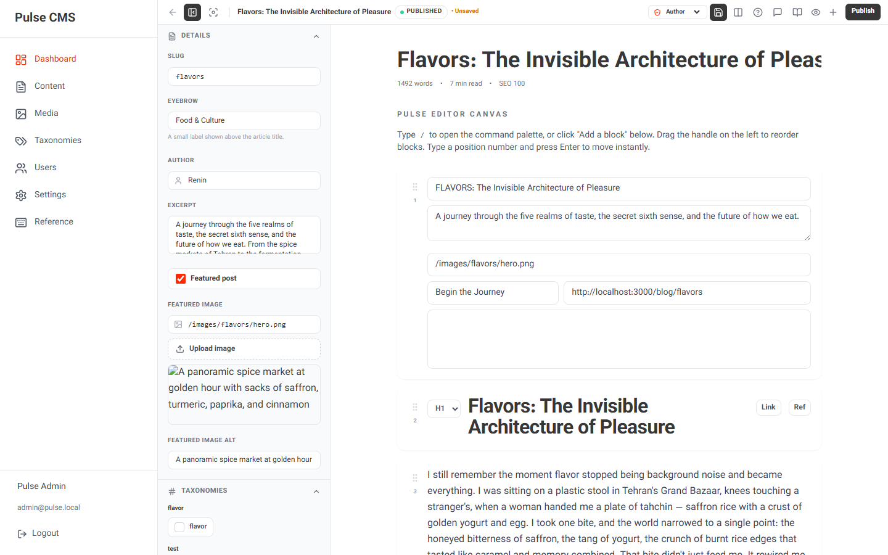
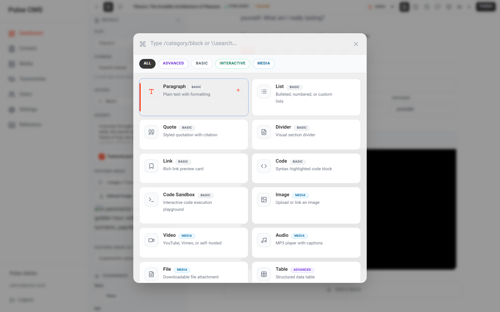
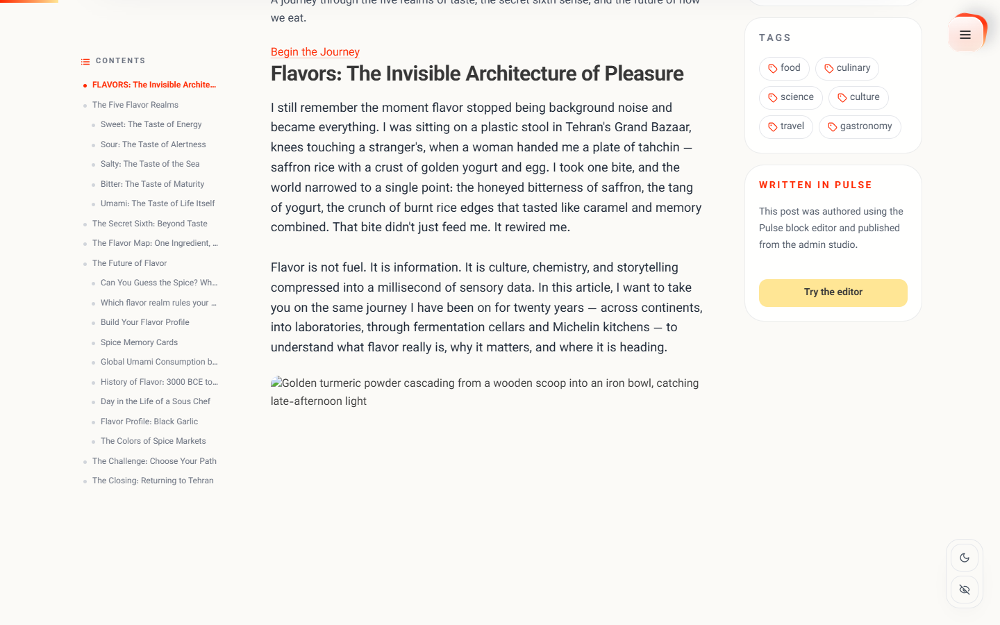
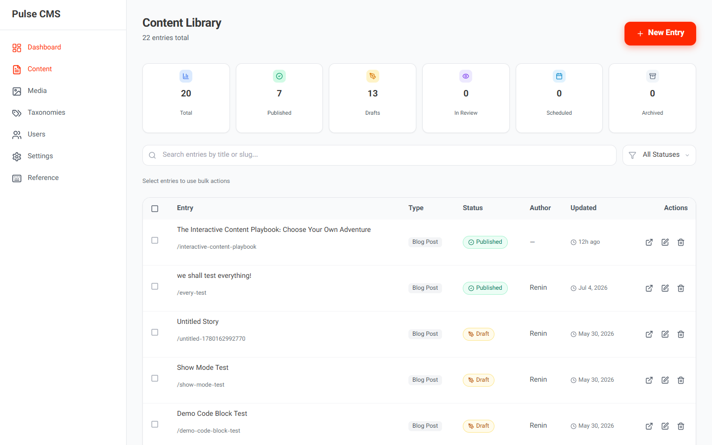
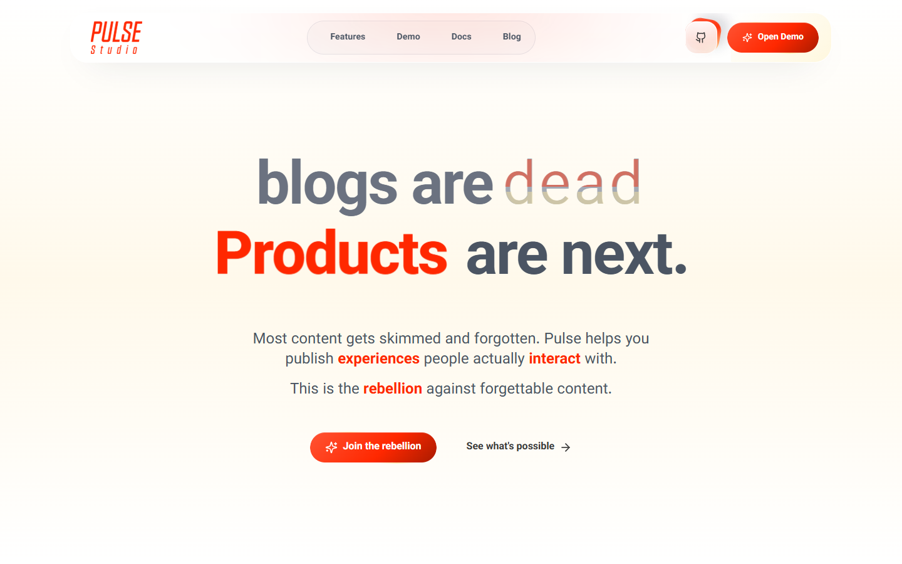

# Pulse CMS

**A block-based, developer-first CMS and blog engine — built with Next.js, TypeScript, and Prisma.**

Pulse is a full publishing platform: a Notion-style block editor, a headless-friendly content API, RBAC admin, media library, taxonomies, scheduled publishing, polls & surveys — all in one self-hostable monorepo. The rendering engine is framework-agnostic TypeScript, so your content is never locked in.

[](LICENSE)
[](https://nextjs.org)
[](https://www.typescriptlang.org)
[](https://www.prisma.io)
[](#testing)

---

## Showcase

| Pulse Studio — block editor | Block palette |
| --- | --- |
|  |  |

| Rendered blog post | Admin — content |
| --- | --- |
|  |  |



## Features

- **Pulse Studio** — a custom block editor (no external editor dependency) with slash commands, drag & drop, inline formatting, and live preview.
- **~40 block types** — rich text, headings, images, galleries, carousels, video, audio, code (Shiki highlighting), math equations, tables, tabs, accordions, flashcards, timelines, maps, before/after sliders, spoilers, callouts, charts, buttons, embeds, and more.
- **Framework-agnostic engine** — `@pulse/core`, `@pulse/blocks`, `@pulse/renderer` are vanilla TypeScript packages. Render content anywhere, with or without React.
- **Full CMS admin** — content types with custom fields, entries with versioning, taxonomies & terms, media library with folders, users/roles/permissions (RBAC), site settings.
- **Scheduled publishing** — publish jobs with cron, entry versions, audit log.
- **Interactive content** — polls and surveys with built-in result tracking.
- **REST API** — 25+ endpoints for entries, media, taxonomies, users, roles, settings, polls, and jobs. JWT auth with refresh tokens, rate limiting, and CORS.
- **SQLite by default, Postgres-ready** — ships with a SQLite schema for zero-config self-hosting; a PostgreSQL schema variant is included for production scale.
- **SEO built in** — per-entry metadata, Open Graph, slugs, semantic rendering.

## Tech stack

| Layer | Choice |
| --- | --- |
| App | Next.js 14 (App Router), React 18, TypeScript 5 |
| Styling | Tailwind CSS 3.4, CSS-variable theming |
| Database | Prisma 5 + SQLite (PostgreSQL variant included) |
| Auth | Custom JWT (`jose`) + bcryptjs, RBAC |
| Monorepo | npm workspaces + Turborepo |
| Testing | Vitest (1200+ tests), Playwright e2e |
| Fonts | Self-hosted (no network font dependencies) |

## Monorepo layout

```
├── apps/
│   └── website/          # Next.js app — public blog, admin, Studio, API
├── packages/
│   ├── core/             # @pulse/core — types, content model, article API
│   ├── blocks/           # @pulse/blocks — ~40 block definitions + renderers
│   ├── editor/           # @pulse/editor — the Studio editing engine (vanilla TS)
│   ├── renderer/         # @pulse/renderer — content → HTML renderer
│   └── react/            # @pulse/react — React bindings
├── phases/               # Development roadmap (agent-driven dev framework)
└── backlog/              # Decisions (ADR-style), done-work archive
```

## Quickstart

```bash
git clone https://github.com/Renin04/pulse-cms.git
cd pulse-cms
npm install

cd apps/website
cp .env.example .env        # then fill JWT_SECRET / JWT_REFRESH_SECRET
npx prisma generate
npx prisma migrate dev
npx tsx prisma/seed.ts      # demo content + admin user (see seed.ts for credentials)

npm run dev                 # http://localhost:3000
```

- Public blog: `http://localhost:3000/blog`
- Admin & Studio: `http://localhost:3000/admin`

### PostgreSQL instead of SQLite

```bash
cp prisma/schema.postgresql.prisma prisma/schema.prisma
# set DATABASE_URL to your Postgres connection string in .env
npx prisma migrate dev
```

## Testing

```bash
npm test            # Vitest — 1200+ unit/integration tests
npm run test:e2e    # Playwright end-to-end (see playwright.config.ts)
npm run ci:local    # lint + typecheck + tests, mirrors CI
```

## Security notes

- **Rate limiting is in-memory and per-process** (`apps/website/lib/rate-limit.ts`). It is correct for the supported single-instance deployment (each tier — auth / CMS writes / general API — gets its own bucket). If you scale to multiple instances, replace the store with Redis (ioredis/bullmq) or limits will be per-node.
- **Refresh tokens are persisted (SHA-256 hashes) and rotated**: presenting a rotated or logged-out token fails closed. Logout revokes server-side.
- **Role ranks**: every role has a `rank`; users can only assign roles below their own rank and modify users ranked below themselves. The last `super_admin` cannot be removed.
- Password reset is intentionally disabled (501) until a real signed-token flow ships.

## Roadmap

- [x] Phase 1 — Core block system & content model
- [x] Phase 2 — Pulse Studio editor
- [x] Phase 3 — Renderer & interactive blocks
- [ ] Phase 4 — AI-assisted writing & publishing
- [ ] Phase 5 — SEO toolkit
- [ ] Phase 6 — Production hardening & hosted demo

See [`phases/`](phases/) for detailed phase plans and [`backlog/DECISIONS.md`](backlog/DECISIONS.md) for architecture decision records.

## Contributing

Contributions are welcome — see [CONTRIBUTING.md](CONTRIBUTING.md). Good first stops: new block types in `packages/blocks`, renderer improvements, and e2e coverage.

## Documentation

- [`docs/README.md`](docs/README.md) — full project documentation
- [`docs/Readme_fa.md`](docs/Readme_fa.md) — معرفی فارسی (Persian introduction)
- [`docs/ARCHITECTURE.md`](docs/ARCHITECTURE.md) — architecture deep-dive

## License

[MIT](LICENSE) © Renin Graphics
